# OneDrive/Blog 以OneDrive为储存的博客“引擎”

将OneDrive中的文件夹作为博客，解析文件夹内文章的内容，发送到前端

[演示Demo](https://onedrive-blog.vercel.app)

## 使用

### 1. 获取项目（任选其一）

* 下载仓库源码并导入自己的仓库（此方法可以创建私有仓库）
* Fork本仓库（不推荐）

部署项目时，可以删除`/assets/doc`文件夹，此文件夹存放的是`README.md`内的图片。

### 2. 修改配置文件

修改根目录下文件`nuxt.config.ts`，初始文件内容如下

```ts
import { defineNuxtConfig } from 'nuxt3'

// https://v3.nuxtjs.org/docs/directory-structure/nuxt.config
export default defineNuxtConfig({
    buildModules: [
        'nuxt-windicss',
    ],
    publicRuntimeConfig: {
        WEBSITE_NAME: 'Arect\'s blog' // 博客的名称，可修改
    },
    privateRuntimeConfig: {
        CLIENT_ID: process.env.CLIENT_ID,
        CLIENT_SECRET: process.env.CLIENT_SECRET,
        REDIRECT_URI: 'http://localhost:3000', // OneDrive的API的重定向地址，根据自己的情况设置
        REFRESH_TOKEN: process.env.REFRESH_TOKEN,
        ROOT_PATH: '/Blog', // 将OneDrive中的/Blog文件夹作为博客目录，可修改
        ONEDRIVE_URI: 'https://graph.microsoft.com/v1.0/me/drive',
        OAUTH_URL: 'https://login.microsoftonline.com/common/oauth2/v2.0/token'
    }
})
```

**注意：** 目录格式为`/Dir1/Dir2/Dir3`，项目内没有其它特殊处理，所以格式错误可能会导致访问出错。

### 3. 获取Token

打开并登录[https://portal.azure.com/#blade/Microsoft_AAD_IAM/ActiveDirectoryMenuBlade/RegisteredApps](https://portal.azure.com/#blade/Microsoft_AAD_IAM/ActiveDirectoryMenuBlade/RegisteredApps) ，或者登录Azure，侧栏中点击“`Azure Active Directory`”，再点击侧栏中的“`应用注册`”。点击新注册。

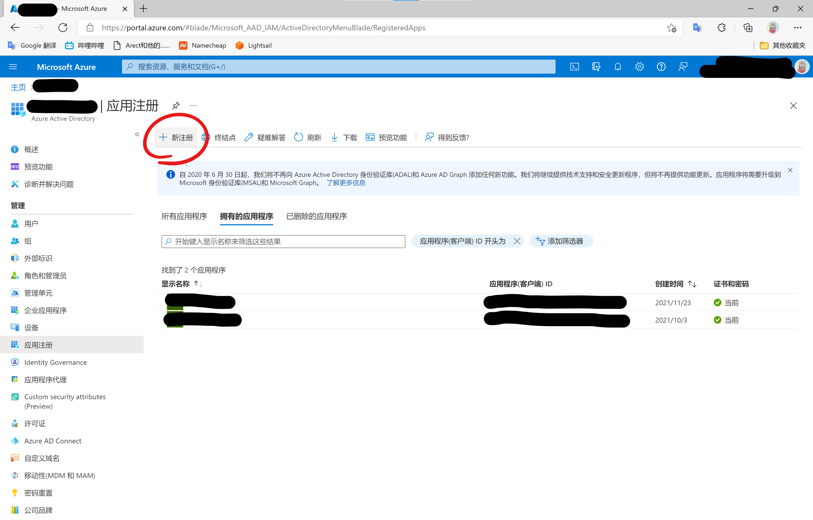

1. 在名称中填入自己喜欢的名字，只是为了辨认；
2. 受支持的帐户类型中选择：“任何组织目录(任何Azure AD目录-多租户)中的帐户和个人Microsoft帐户(例如，Skype、Xbox)”；
3. 重定向URI中选择“`Web`”，并填入“`http://localhost:3000`”（图中填写的没有“:3000”，这个推荐加上）；
4. 点击注册。

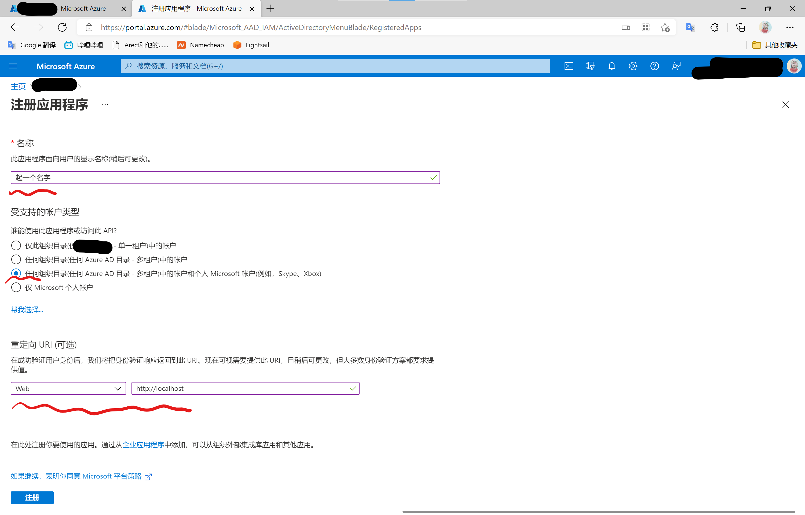

跳转到应用界面后，复制“应用程序(客户端)ID”。

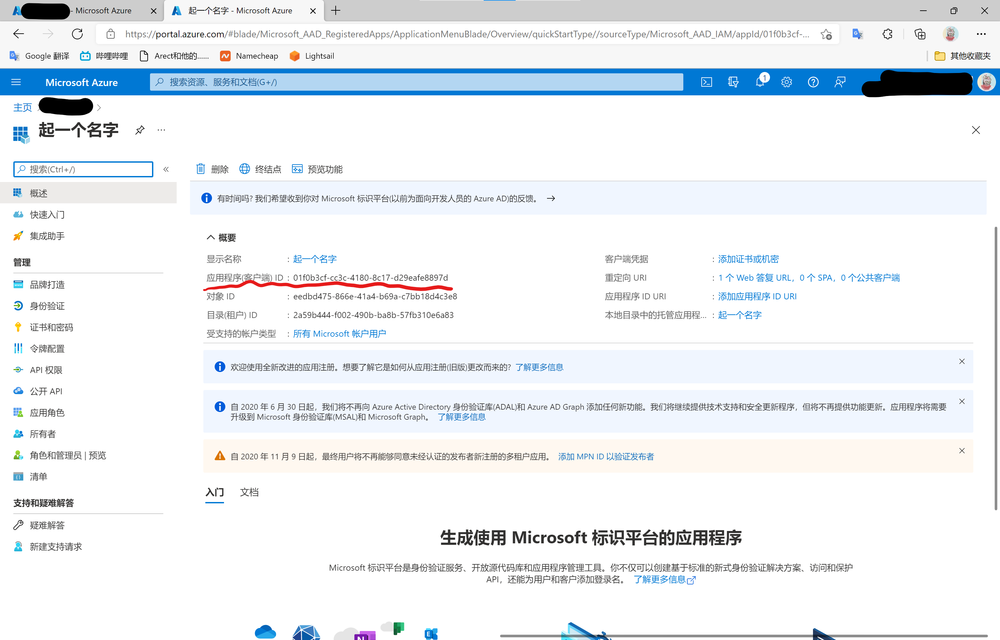

1. 点击侧栏“证书和密码”；
2. 点击“新客户端密码”；
3. 在右侧弹出栏中填写说明和截止期限，截止期限可以随自己心情选择，最长两年；
4. 点击添加。

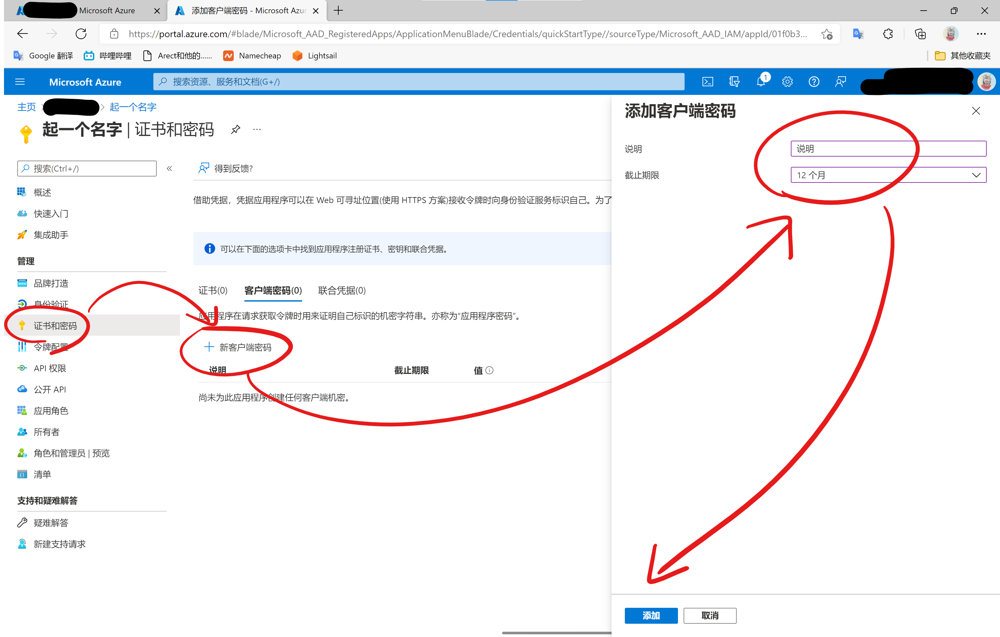

添加成功后，复制密钥。**注意：密钥只有第一次添加时才会显示，如果退出页面则无法再次获取。而且，密钥是“*值*”，而不是“*机密ID*”**

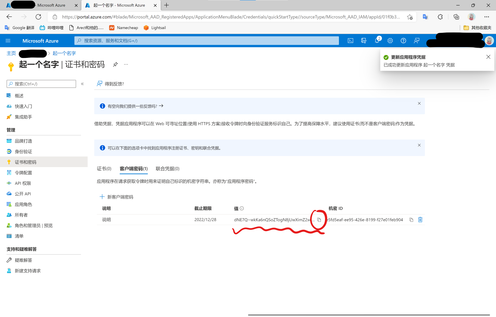

1. 点击“API权限”；
2. 点击“添加权限”；
3. 在右侧弹出栏中选择“`Microsoft Graph`”；
4. 选择“委托的权限”；
5. 勾选“`Files.Read`”和“`offline_access`”；
6. 点击添加权限；
7. 点击“`User.Read`”的更多操作，点击“撤销权限”（默认配置该权限，但是本项目未使用此API，可以撤销）
8. 点击“代表xxx授予管理员同意”

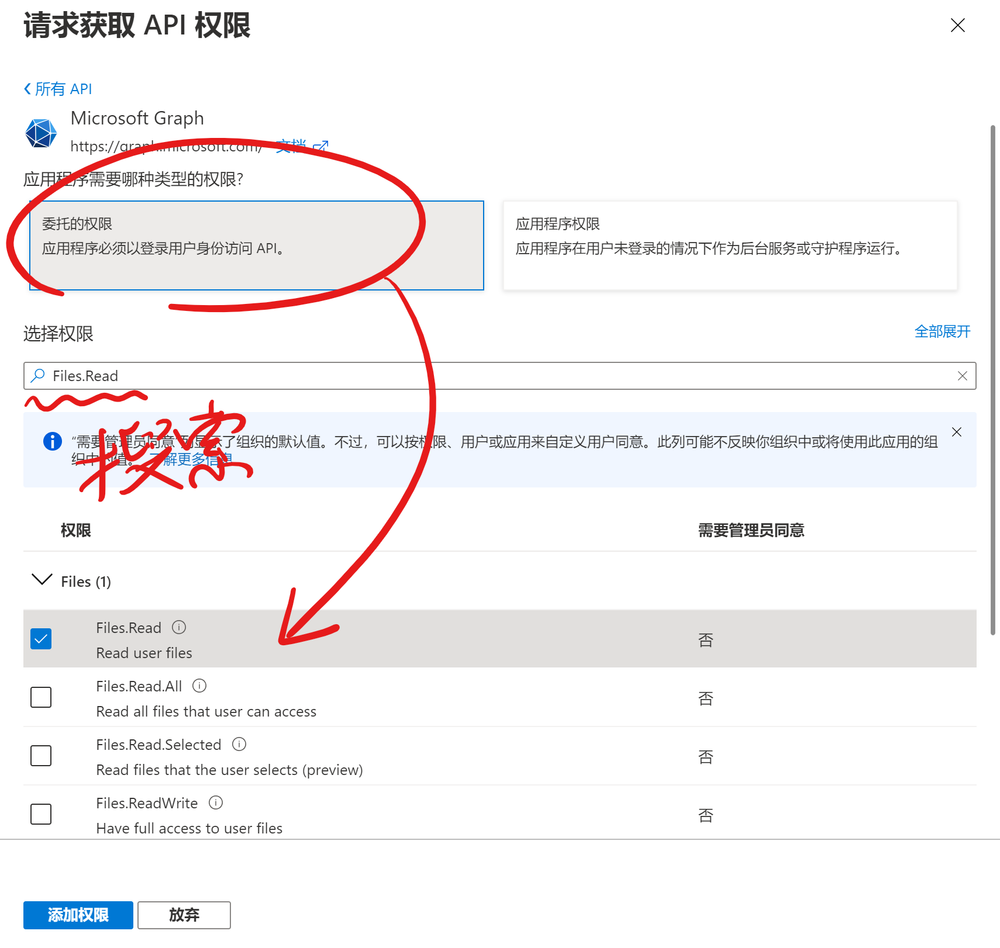

接下来是最麻烦的获取`refresh_token`。

1. 安装`Node.js`；
2. 控制台执行`npx @beetcb/ms-graph-cli`；
3. 选择“`Global`”，回车；
4. 选择“`OneDrive`”，回车；
5. 按步骤填入值；
6. 跳转到浏览器登录账户，点击接受，如果成功，将可以返回控制台；
7. 控制台会弹出`refresh_token`，保存

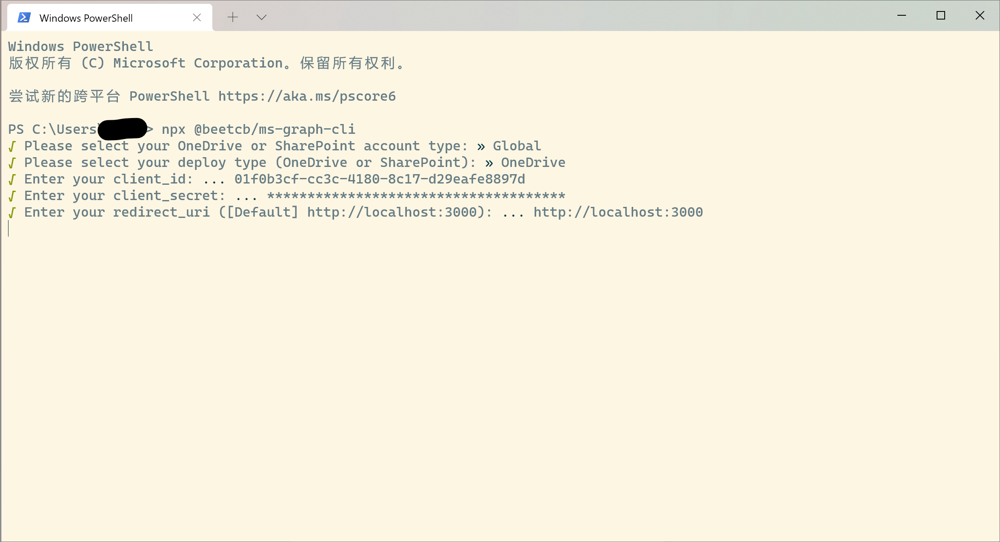

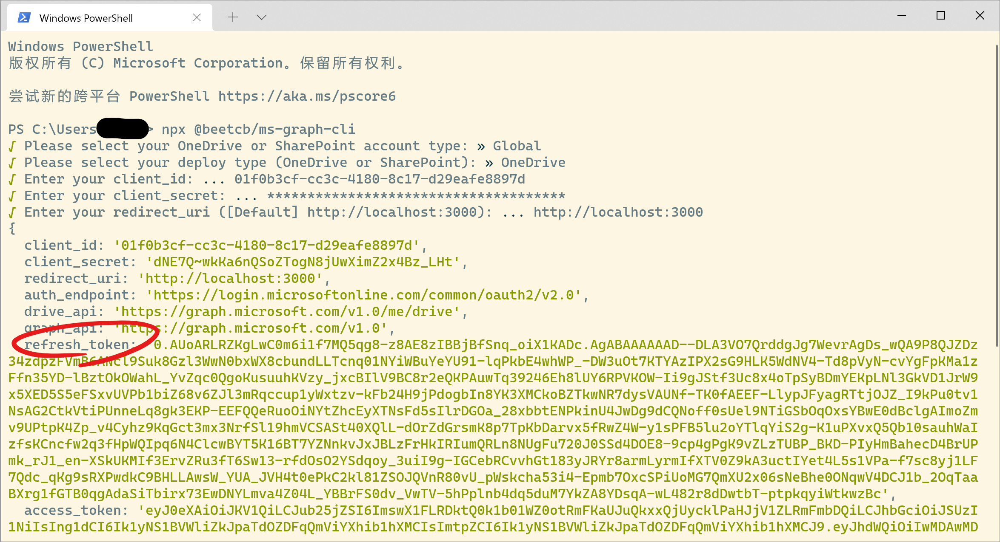

如果你能肯定成功部署，即可以卸载`Nodejs`。此时，已经获取`client_id`、`client_secret`、`refresh_token`。

*教程中示例的token我都删了，不用试的。*

### 4. 部署至Vercel

在Vercel中新建项目，导入你的仓库，在部署前设置环境

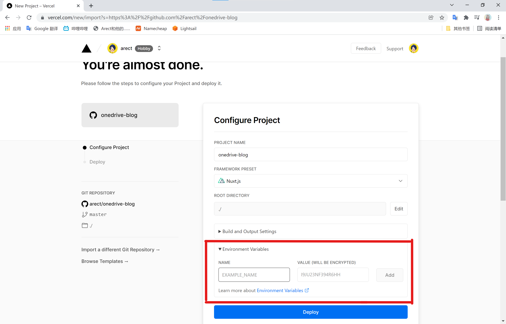

填入：

| 环境名 | 值                  |
|:----|:-------------------|
| CLIENT_ID | 上文获取的client_id     |
| CLIENT_SECRET | 上文获取的client_secret |
| REFRESH_TOKEN | 上文获取的refresh_token |

如果你的项目是私有的，可以直接在`nuxt.config.ts`中填写。请千万保护自己的Token们。

点击部署按钮，等待部署完成。部署完成后可以自定义域名，这些就不在讨论范围内了。

### 5. 开始使用

#### 全局设置

在你的OneDrive文件夹内，创建`settings.json`，内容如下：

```json
{
    "saying": "出现在博客上方的一行大字",
    "desc": true,
    "button": "点击阅读按钮上的字"
}
```

目前只有这些（欸嘿嘿），`desc`是指文章的排序方式，顺序或逆序。

#### 编写文章

在博客文件夹内新建文件夹，命名格式为`index-title`，例如`1-第一篇文章`，项目将第一个`-`用于分隔序号和标题。

进入文件夹，创建文件`index.html`、`index.md`或`index.txt`，可以编写`html`或是`Markdown`或是纯文本。`Markdown`中如果需要插入图片，可以将图片存在文章文件夹根目录，在`Markdown`中插入``。例如：

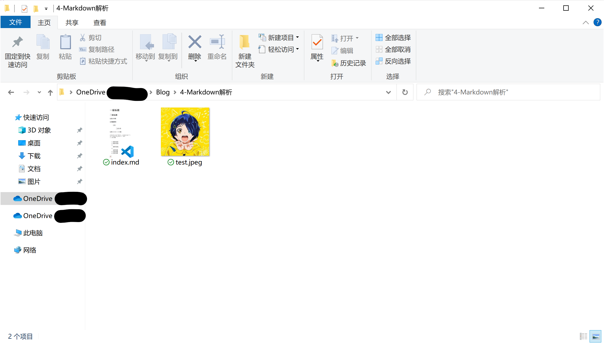

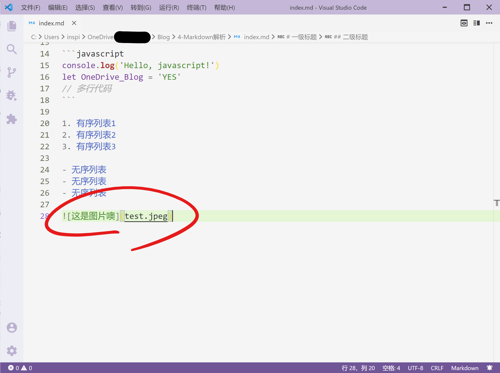

创建`settings.json`，输入内容如下：
```json
{
    "password": "123"
}
```

可以对文章创建密码。 目前所有的`settings.json`都可空。

此时OneDrive文件夹应该如下所示：

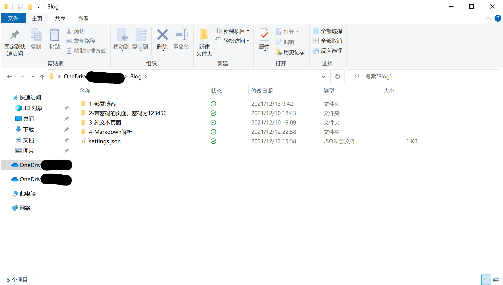

> 遇到问题可以直接发issue

## 关于UI

因为Nuxt3支持的UI框架还比较少，所以目前的界面样式都还是简单设计的，可能不是很好看。如果希望有更好看的界面的话，不妨自己动手，将本项目作为API，自己编写前端。目前本项目只有两个API，放在`server/api`目录下（能动手写前端，应该能看懂API返回的内容）。但是后期我还想添加内容，所以接口大概还会调整。

## 下一步

暂时没什么需求了，目前主要是UI太难看，但是手残不会画，所以还是等Nuxt3完善之后，别的UI框架也跟进之后，再考虑更换UI吧。如果有什么需求也可以提出来，会考虑实现的。

同时也考虑到这是一个不方便更新的项目，频繁更新会带来不好的体验，所以……咕咕咕？

## 闲话

关于为什么要做这个项目呢？都用上Vercel了，为什么不直接上Hexo呢？emm因为我想自己做点东西，调用一下微软的API，至于为什么要**调用**微软的API，懂的都懂，不懂的可以直接去用Hexo了，这才是真的博客引擎。

Markdown样式来自`Github-markdown-css`，但是为了兼容深色模式所以不得不保存到项目并修改了一小部分。感谢[Github-markdown-css](https://github.com/sindresorhus/github-markdown-css)
